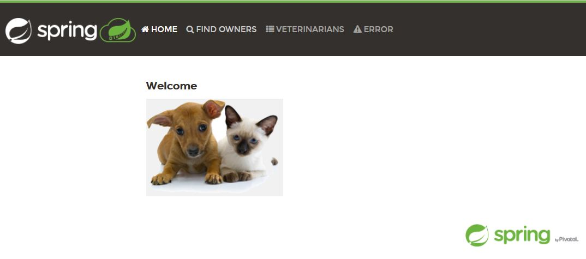

# Run Spring PetClinic Sample Application as native image and Docker container  
## Summary  
1. Run the famous [Spring PetClinic](https://projects.spring.io/spring-petclinic/) Sample Application as native image  
2. Run this sample with lightweight Docker container embedded with native executable  
## Environment
* OS: Windows10 + WSL(Windows Subsystem for Linux) + Ubuntu20.04  
* GraalVM EE 21.3.0 with Java11(Installation guide can be referenced from https://github.com/junsuzu/graalvm-jp-handson-basic/)  
* Docker Engine 20.10.8 on Ubuntu within WSL ([Install Docker Engine on Ubuntu](https://nickjanetakis.com/blog/setting-up-docker-for-windows-and-wsl-to-work-flawlessly))  
* Docker Desktop for Windows 3.6.0([Install Docker Desktop for Windows](https://docs.docker.jp/docker-for-windows/install.html))  
## Contents
* **[Exercise1: Run Spring PetClinic as fat jar](#Exercise1-Run-Spring-PetClinic-as-fat-jar)**
   * [1.1 Download Spring PetClinic Sample Application](#11-Download-Spring-PetClinic-Sample-Application)
   * [1.2 Build and run Spring PetClinic as fat jar](#12-Build-and-run-Spring-PetClinic-as-fat-jar)

* **[Exercise2: Run Spring PetClinic as native image](#Exercise2-Run-Spring-PetClinic-as-native-image)**
   * [2.1 Configuration of Spring Native dependency](#21-Configuration-of-Spring-Native-dependency)
   * [2.2 Configuration of Spring AOT plugin](#22-Configuration-of-Spring-AOT-plugin)
   * [2.3 Configuration of native build tools plugin](#23-Configuration-of-native-build-tools-plugin)
   * [2.4 Configuration of repository for dependency and plugin](#24-Configuration-of-repository-for-dependency-and-plugin)
   * [2.5 Workaround for runtime error](#25-Workaround-for-runtime-error)
   * [2.6 Build and run the sample as naitve image](#26-Build-and-run-the-sample-as-naitve-image)

* **[Exercise3: Run Spring PetClinic as Docker container](#Exercise3-Run-Spring-PetClinic-as-Docker-container)**
   * [3.1 Build lightweight Docker container embedded with native executable](#31-Build-lightweight-docker-container-embedded-with-native-executable)
   * [3.2 Run Spring PetClinic as Docker container](#32-Run-Spring-PetClinic-as-docker-container)
</br>

## Exercise1: Run Spring PetClinic as fat jar  
Build Spring PetClinic Sample Application into a FAT jar, and run it on GraalVM using traditional java command.
### 1.1 Download Spring PetClinic Sample Application 
>```sh
>$ git clone https://github.com/spring-projects/spring-petclinic.git
>```
### 1.2 Build and run Spring PetClinic as fat jar  
Change java version from 1.8 to 11 according to environment.
```
<parent>
    <groupId>org.springframework.boot</groupId>
    <artifactId>spring-boot-starter-parent</artifactId>
    <version>2.5.6</version>
  </parent>
  <name>petclinic</name>

  <properties>

    <!-- Generic properties -->
    <java.version>11</java.version>
    <project.build.sourceEncoding>UTF-8</project.build.sourceEncoding>
    <project.reporting.outputEncoding>UTF-8</project.reporting.outputEncoding>
```  

Use maven command to build the application  
>```sh
>$ cd /spring-petclinic
>$ ./mvnw clean package -DskipTests=true
>```

Run the fat jar and confirm the startup time of the application.  
>```sh
>$ java -jar target/spring-petclinic-2.5.0-SNAPSHOT.jar
>```

```
java -jar target/spring-petclinic-2.5.0-SNAPSHOT.jar


              |\      _,,,--,,_
             /,`.-'`'   ._  \-;;,_
  _______ __|,4-  ) )_   .;.(__`'-'__     ___ __    _ ___ _______
 |       | '---''(_/._)-'(_\_)   |   |   |   |  |  | |   |       |
 |    _  |    ___|_     _|       |   |   |   |   |_| |   |       | __ _ _
 |   |_| |   |___  |   | |       |   |   |   |       |   |       | \ \ \ \
 |    ___|    ___| |   | |      _|   |___|   |  _    |   |      _|  \ \ \ \
 |   |   |   |___  |   | |     |_|       |   | | |   |   |     |_    ) ) ) )
 |___|   |_______| |___| |_______|_______|___|_|  |__|___|_______|  / / / /
 ==================================================================/_/_/_/

:: Built with Spring Boot :: 2.5.6


2021-11-29 12:01:19.279  INFO 1169 --- [           main] o.s.s.petclinic.PetClinicApplication     : Starting PetClinicApplication v2.5.0-SNAPSHOT using Java 11.0.13 on JUNSUZU-JP with PID 1169 (/home/linuser/project/tmp/test/spring-petclinic/target/spring-petclinic-2.5.0-SNAPSHOT.jar started by linuser in /home/linuser/project/tmp/test/spring-petclinic)
2021-11-29 12:01:19.285  INFO 1169 --- [           main] o.s.s.petclinic.PetClinicApplication     : No active profile set, falling back to default profiles: default
2021-11-29 12:01:20.426  INFO 1169 --- [           main] .s.d.r.c.RepositoryConfigurationDelegate : Bootstrapping Spring Data JPA repositories in DEFAULT mode.
2021-11-29 12:01:20.498  INFO 1169 --- [           main] .s.d.r.c.RepositoryConfigurationDelegate : Finished Spring Data repository scanning in 60 ms. Found 4 JPA repository interfaces.
2021-11-29 12:01:21.313  INFO 1169 --- [           main] o.s.b.w.embedded.tomcat.TomcatWebServer  : Tomcat initialized with port(s): 8080 (http)
2021-11-29 12:01:21.357  INFO 1169 --- [           main] o.apache.catalina.core.StandardService   : Starting service [Tomcat]
2021-11-29 12:01:21.361  INFO 1169 --- [           main] org.apache.catalina.core.StandardEngine  : Starting Servlet engine: [Apache Tomcat/9.0.54]
2021-11-29 12:01:21.563  INFO 1169 --- [           main] o.a.c.c.C.[Tomcat].[localhost].[/]       : Initializing Spring embedded WebApplicationContext
2021-11-29 12:01:21.566  INFO 1169 --- [           main] w.s.c.ServletWebServerApplicationContext : Root WebApplicationContext: initialization completed in 2203 ms
2021-11-29 12:01:22.304  INFO 1169 --- [           main] com.zaxxer.hikari.HikariDataSource       : HikariPool-1 - Starting...
2021-11-29 12:01:23.062  INFO 1169 --- [           main] com.zaxxer.hikari.HikariDataSource       : HikariPool-1 - Start completed.
2021-11-29 12:01:24.083  INFO 1169 --- [           main] org.ehcache.core.EhcacheManager          : Cache 'vets' created in EhcacheManager.
2021-11-29 12:01:24.123  INFO 1169 --- [           main] org.ehcache.jsr107.Eh107CacheManager     : Registering Ehcache MBean javax.cache:type=CacheStatistics,CacheManager=urn.X-ehcache.jsr107-default-config,Cache=vets
2021-11-29 12:01:24.149  INFO 1169 --- [           main] org.ehcache.jsr107.Eh107CacheManager     : Registering Ehcache MBean javax.cache:type=CacheStatistics,CacheManager=urn.X-ehcache.jsr107-default-config,Cache=vets
2021-11-29 12:01:24.326  INFO 1169 --- [           main] o.hibernate.jpa.internal.util.LogHelper  : HHH000204: Processing PersistenceUnitInfo [name: default]
2021-11-29 12:01:24.533  INFO 1169 --- [           main] org.hibernate.Version                    : HHH000412: Hibernate ORM core version 5.4.32.Final
2021-11-29 12:01:24.980  INFO 1169 --- [           main] o.hibernate.annotations.common.Version   : HCANN000001: Hibernate Commons Annotations {5.1.2.Final}
2021-11-29 12:01:25.461  INFO 1169 --- [           main] org.hibernate.dialect.Dialect            : HHH000400: Using dialect: org.hibernate.dialect.H2Dialect
2021-11-29 12:01:27.564  INFO 1169 --- [           main] o.h.e.t.j.p.i.JtaPlatformInitiator       : HHH000490: Using JtaPlatform implementation: [org.hibernate.engine.transaction.jta.platform.internal.NoJtaPlatform]
2021-11-29 12:01:27.597  INFO 1169 --- [           main] j.LocalContainerEntityManagerFactoryBean : Initialized JPA EntityManagerFactory for persistence unit 'default'
2021-11-29 12:01:31.715  INFO 1169 --- [           main] o.s.b.a.e.web.EndpointLinksResolver      : Exposing 13 endpoint(s) beneath base path '/actuator'
2021-11-29 12:01:31.854  INFO 1169 --- [           main] o.s.b.w.embedded.tomcat.TomcatWebServer  : Tomcat started on port(s): 8080 (http) with context path ''
2021-11-29 12:01:31.904  INFO 1169 --- [           main] o.s.s.petclinic.PetClinicApplication     : Started PetClinicApplication in 13.193 seconds (JVM running for 13.795)
```

Access Spring PetClinic from browser to confirm the application running properly: http://localhost:8080  

   

<br/>
 

<br/>

## Exercise2: Run Spring PetClinic as native image  
By following the guide of [Spring Native documentation](https://docs.spring.io/spring-native/docs/current/reference/htmlsingle/), build the sample into native image without changing the application.
### 2.1 Configuration of Spring Native dependency
Specify Spring Native dependency required to run a Spring  application as a native image.
```
<dependencies>
    <!-- ... -->
    <dependency>
        <groupId>org.springframework.experimental</groupId>
        <artifactId>spring-native</artifactId>
        <version>0.10.5</version>
    </dependency>
</dependencies>
```
### 2.2 Configuration of Spring AOT plugin
Specify spring-aot-maven-plugin（0.10.5）requried to perform ahead-of-time transformation.
```
<build>
    <plugins>
        <!-- ... -->
        <plugin>
            <groupId>org.springframework.experimental</groupId>
            <artifactId>spring-aot-maven-plugin</artifactId>
            <version>0.10.5</version>
            <executions>
                <execution>
                    <id>test-generate</id>
                    <goals>
                        <goal>test-generate</goal>
                    </goals>
                </execution>
                <execution>
                    <id>generate</id>
                    <goals>
                        <goal>generate</goal>
                    </goals>
                </execution>
            </executions>
        </plugin>
    </plugins>
</build>
```
### 2.3 Configuration of native build tools plugin
Specify native-maven-plugin(0.9.4) within a native profile as below, which is required to use native build tools plugin provided by GraalVM to invoke native image comiler.  
Be sure to pass native-image build options by using <buildArgs> configuration parameter, to make the native image linked all dependency libraries statically in build phase except for libc.

```
<profile>
  <id>native</id>
  <build>
      <plugins>
          <plugin>
              <groupId>org.graalvm.buildtools</groupId>
              <artifactId>native-maven-plugin</artifactId>
              <version>0.9.4</version>
              <executions>
                  <execution>
                      <id>test-native</id>
                      <goals>
                          <goal>test</goal>
                      </goals>
                      <phase>test</phase>
                  </execution>
                  <execution>
                      <id>build-native</id>
                      <goals>
                          <goal>build</goal>
                      </goals>
                      <phase>package</phase>
                  </execution>
              </executions>
              <configuration>
                  <!-- add native-image build arguments -->
                  <buildArgs>
                    <buildArg>--no-fallback</buildArg>
                    <buildArg>-H:+StaticExecutableWithDynamicLibC</buildArg>
                  </buildArgs>
              </configuration>
          </plugin>
          <!-- Avoid a clash between Spring Boot repackaging and native-maven-plugin -->
          <plugin>
              <groupId>org.springframework.boot</groupId>
              <artifactId>spring-boot-maven-plugin</artifactId>
              <configuration>
                  <classifier>exec</classifier>
              </configuration>
          </plugin>
      </plugins>
  </build>
</profile>
```
### 2.4 Configuration of repository for dependency and plugin
To include the release repository for spring-native dependency, add repository information in pom.xml as below:
```
<repositories>
		<!-- ... -->
		<repository>
			<id>spring-release</id>
			<name>Spring release</name>
			<url>https://repo.spring.io/release</url>
		</repository>
	</repositories>
```
```
<pluginRepositories>
		<!-- ... -->
		<pluginRepository>
			<id>spring-release</id>
			<name>Spring release</name>
			<url>https://repo.spring.io/release</url>
		</pluginRepository>
	</pluginRepositories>
```
### 2.5 Workaround for runtime error
At this point, there are some runtime errors while running the sample in native image, which could be fixed by using workaround as below:  
* Comment out the part of spring-boot-devtools
```
<!-- dependency>
  <groupId>org.springframework.boot</groupId>
  <artifactId>spring-boot-devtools</artifactId>
  <optional>true</optional>
</dependency -->

```
* Comment out the contents of CacheConfiguration class:
```
package org.springframework.samples.petclinic.system;

import org.springframework.boot.autoconfigure.cache.JCacheManagerCustomizer;
import org.springframework.cache.annotation.EnableCaching;
import org.springframework.context.annotation.Bean;
import org.springframework.context.annotation.Configuration;

import javax.cache.configuration.MutableConfiguration;

/**
 * Cache configuration intended for caches providing the JCache API. This configuration
 * creates the used cache for the application and enables statistics that become
 * accessible via JMX.
 */
//@Configuration(proxyBeanMethods = false)
//@EnableCaching
class CacheConfiguration {

//	@Bean
//	public JCacheManagerCustomizer petclinicCacheConfigurationCustomizer() {
//		return cm -> {
//			cm.createCache("vets", cacheConfiguration());
//		};
//	}

	/**
	 * Create a simple configuration that enable statistics via the JCache programmatic
	 * configuration API.
	 * <p>
	 * Within the configuration object that is provided by the JCache API standard, there
	 * is only a very limited set of configuration options. The really relevant
	 * configuration options (like the size limit) must be set via a configuration
	 * mechanism that is provided by the selected JCache implementation.
	 */
	//private javax.cache.configuration.Configuration<Object, Object> cacheConfiguration() {
	//	return new MutableConfiguration<>().setStatisticsEnabled(true);
	//}
}
```
If you encountered format error after doing above comment out, run following command to fix.  
>```sh
>./mvnw spring-javaformat:apply
>```

### 2.6 Build and run the sample as naitve image
Use following command to build the application.
>```sh
>$ cd /spring-petclinic
>$ ./mvnw -Pnative -DskipTests package
>```
<br/>

```
[spring-petclinic:9625]     (clinit):   4,848.07 ms,  8.21 GB
[spring-petclinic:9625]   (typeflow):  84,575.98 ms,  8.23 GB
[spring-petclinic:9625]    (objects): 214,809.69 ms,  8.23 GB
[spring-petclinic:9625]   (features):  50,839.22 ms,  8.23 GB
[spring-petclinic:9625]     analysis: 471,844.50 ms,  8.23 GB
[spring-petclinic:9625]     universe:  26,851.50 ms,  8.23 GB
[spring-petclinic:9625]      (parse):  32,461.57 ms,  7.60 GB
[spring-petclinic:9625]     (inline):  16,762.41 ms,  7.05 GB
[spring-petclinic:9625]    (compile): 307,731.81 ms,  8.85 GB
[spring-petclinic:9625]      compile: 382,525.26 ms,  8.85 GB
[spring-petclinic:9625]        image:  35,918.80 ms,  8.85 GB
[spring-petclinic:9625]        write:  19,416.11 ms,  8.85 GB
[spring-petclinic:9625]      [total]: 951,614.03 ms,  8.85 GB
# Printing build artifacts to: /home/linuser/project/tmp/spring-petclinic/target/spring-petclinic.build_artifacts.txt
[INFO]
[INFO] --- spring-boot-maven-plugin:2.5.6:repackage (repackage) @ spring-petclinic ---
[INFO] Attaching repackaged archive /home/linuser/project/tmp/spring-petclinic/target/spring-petclinic-2.5.0-SNAPSHOT-exec.jar with classifier exec
[INFO] ------------------------------------------------------------------------
[INFO] BUILD SUCCESS
[INFO] ------------------------------------------------------------------------
[INFO] Total time:  16:29 min
[INFO] Finished at: 2021-11-25T18:58:18+09:00
[INFO] ------------------------------------------------------------------------
```  

Run the sample using native image which has been built before.

>```sh
>$ cd /spring-petclinic
>$ ./target/spring-petclinic
>```

Confirm the Spring PetClinic starting up with less time compared with JIT mode.  

```
./target/spring-petclinic
2021-11-25 19:28:47.017  INFO 9862 --- [           main] o.s.nativex.NativeListener               : This application is bootstrapped with code generated with Spring AOT

  .   ____          _            __ _ _
 /\\ / ___'_ __ _ _(_)_ __  __ _ \ \ \ \
( ( )\___ | '_ | '_| | '_ \/ _` | \ \ \ \
 \\/  ___)| |_)| | | | | || (_| |  ) ) ) )
  '  |____| .__|_| |_|_| |_\__, | / / / /
 =========|_|==============|___/=/_/_/_/
 :: Spring Boot ::                (v2.5.6)

2021-11-25 19:28:47.023  INFO 9862 --- [           main] o.s.s.petclinic.PetClinicApplication     : Starting PetClinicApplication v2.5.0-SNAPSHOT using Java 11.0.13 on JUNSUZU-JP with PID 9862 (/home/linuser/project/tmp/spring-petclinic/target/spring-petclinic started by linuser in /home/linuser/project/tmp/spring-petclinic/target)
2021-11-25 19:28:47.023  INFO 9862 --- [           main] o.s.s.petclinic.PetClinicApplication     : No active profile set, falling back to default profiles: default
2021-11-25 19:28:47.079  INFO 9862 --- [           main] .s.d.r.c.RepositoryConfigurationDelegate : Bootstrapping Spring Data JPA repositories in DEFAULT mode.
2021-11-25 19:28:47.083  INFO 9862 --- [           main] .s.d.r.c.RepositoryConfigurationDelegate : Finished Spring Data repository scanning in 1 ms. Found 4 JPA repository interfaces.
2021-11-25 19:28:47.119  INFO 9862 --- [           main] o.s.b.w.embedded.tomcat.TomcatWebServer  : Tomcat initialized with port(s): 8080 (http)
2021-11-25 19:28:47.121  INFO 9862 --- [           main] o.apache.catalina.core.StandardService   : Starting service [Tomcat]
2021-11-25 19:28:47.127  INFO 9862 --- [           main] org.apache.catalina.core.StandardEngine  : Starting Servlet engine: [Apache Tomcat/9.0.54]
2021-11-25 19:28:47.135  INFO 9862 --- [           main] o.a.c.c.C.[Tomcat].[localhost].[/]       : Initializing Spring embedded WebApplicationContext
2021-11-25 19:28:47.136  INFO 9862 --- [           main] w.s.c.ServletWebServerApplicationContext : Root WebApplicationContext: initialization completed in 111 ms
2021-11-25 19:28:47.140  WARN 9862 --- [           main] i.m.c.i.binder.jvm.JvmGcMetrics          : GC notifications will not be available because MemoryPoolMXBeans are not provided by the JVM
2021-11-25 19:28:47.162  INFO 9862 --- [           main] com.zaxxer.hikari.HikariDataSource       : HikariPool-1 - Starting...
2021-11-25 19:28:47.168  INFO 9862 --- [           main] com.zaxxer.hikari.HikariDataSource       : HikariPool-1 - Start completed.
2021-11-25 19:28:47.186  INFO 9862 --- [           main] o.hibernate.jpa.internal.util.LogHelper  : HHH000204: Processing PersistenceUnitInfo [name: default]
2021-11-25 19:28:47.187  INFO 9862 --- [           main] org.hibernate.Version                    : HHH000412: Hibernate ORM core version 5.4.32.Final
2021-11-25 19:28:47.190  INFO 9862 --- [           main] o.hibernate.annotations.common.Version   : HCANN000001: Hibernate Commons Annotations {5.1.2.Final}
2021-11-25 19:28:47.198  INFO 9862 --- [           main] org.hibernate.dialect.Dialect            : HHH000400: Using dialect: org.hibernate.dialect.H2Dialect
2021-11-25 19:28:47.199  WARN 9862 --- [           main] org.hibernate.dialect.H2Dialect          : HHH000431: Unable to determine H2 database version, certain features may not work
2021-11-25 19:28:47.209  INFO 9862 --- [           main] o.h.e.t.j.p.i.JtaPlatformInitiator       : HHH000490: Using JtaPlatform implementation: [org.hibernate.engine.transaction.jta.platform.internal.NoJtaPlatform]
2021-11-25 19:28:47.211  INFO 9862 --- [           main] j.LocalContainerEntityManagerFactoryBean : Initialized JPA EntityManagerFactory for persistence unit 'default'
2021-11-25 19:28:47.273  INFO 9862 --- [           main] o.s.b.a.e.web.EndpointLinksResolver      : Exposing 13 endpoint(s) beneath base path '/actuator'
2021-11-25 19:28:47.285  INFO 9862 --- [           main] o.s.b.w.embedded.tomcat.TomcatWebServer  : Tomcat started on port(s): 8080 (http) with context path ''
2021-11-25 19:28:47.287  INFO 9862 --- [           main] o.s.s.petclinic.PetClinicApplication     : Started PetClinicApplication in 0.285 seconds (JVM running for 0.287)
```  


## Exercise3: Run Spring PetClinic as Docker container  
Some text
### 3.1 Build lightweight Docker container embedded with native executable

(1)Create Dockerfile under spring-petclinic directory. Specify the native image built in Exercise2.
```
FROM gcr.io/distroless/base
COPY target/spring-petclinic/ app
ENTRYPOINT ["/app"]
```
(2)Build Docker image as below.
>```sh
> docker build -f Dockerfile -t spring-petclinic:distroless .
>```

(3)Use docker command to confirm Docker image.
```
$ docker images
REPOSITORY                 TAG              IMAGE ID       CREATED         SIZE
spring-petclinic           distroless       8d361935d447   3 minutes ago   227MB
```
### 3.2 Run Spring PetClinic as Docker container
Run Spring PetClinic as Docker container, compare the startup time with JIT mode and native mode.
```
docker run --rm -p 8080:8080 spring-petclinic:distroless
2021-11-25 13:52:55.278  INFO 1 --- [           main] o.s.nativex.NativeListener               : This application is bootstrapped with code generated with Spring AOT

  .   ____          _            __ _ _
 /\\ / ___'_ __ _ _(_)_ __  __ _ \ \ \ \
( ( )\___ | '_ | '_| | '_ \/ _` | \ \ \ \
 \\/  ___)| |_)| | | | | || (_| |  ) ) ) )
  '  |____| .__|_| |_|_| |_\__, | / / / /
 =========|_|==============|___/=/_/_/_/
 :: Spring Boot ::                (v2.5.6)

2021-11-25 13:52:55.280  INFO 1 --- [           main] o.s.s.petclinic.PetClinicApplication     : Starting PetClinicApplication v2.5.0-SNAPSHOT using Java 11.0.13 on 78336b528188 with PID 1 (/app started by root in /)
.............
2021-11-25 13:52:55.456  INFO 1 --- [           main] o.s.b.w.embedded.tomcat.TomcatWebServer  : Tomcat started on port(s): 8080 (http) with context path ''
2021-11-25 13:52:55.457  INFO 1 --- [           main] o.s.s.petclinic.PetClinicApplication     : Started PetClinicApplication in 0.185 seconds (JVM running for 0.186)
```

Confirm the application by access http://localhost:8080/ .

